# Introduction

This demo shows how KFP SDK can be used to create the Data Science Pipeline in OpenShift AI. 

# Important Disclaimer

> IMPORTANT DISCLAIMER: Read before proceed!
> 1. These examples are to showcase the capabilities of OpenShift AI.
> 1. Certain components may not be supported if they are using upstream projects.
> 1. Always check with Red Hat or your account team for supportability. 

# Requirements

* Tested on OpenShift 4.16/4.17 with cluster-admin
* Tested on OpenShift AI 2.17 with Model Registry set to `Managed` inn DataScienceCluster `default-dsc`:
    ``` yaml
    spec:
      components:
        modelregistry:
          managementState: Managed
          registriesNamespace: rhoai-model-registries
    ```

* OpenShift Service Mesh is installed
* OpenShift Severless is installed
* Authorino is installed

# Setup

This demo will be installed in the `dsp-demo-creditcard-fraud` namespace.

``` bash
make setup-dsp-demo
``` 

Additionally, it will install the following components:

| Component    | Namespace | Description |
| -------- | ------- | ------- | 
| Gitea  | gitea | Store our pipeline code     |
| OpenShift Pipeline  | dsp-demo-creditcard-fraud | To build our Data Science Pipeline using KFP SDK |
| Model Registry | rhoai-model-registries | To store the model meta information     |
| MariaDB | rhoai-model-registries | MySQL backend for model registry
| Data Science Pipeline | dsp-demo-creditcard-fraud | To run the pipeline     |
| Minio    | dsp-demo-creditcard-fraud | To store the model and pipeline artifacts    |

To teardown the entire setup. This will delete the namespace and the model registry.

``` bash
make teardown-all
```

## Minio

The credential for minio is `minio/minio123`. Route for minio is:

``` bash
echo "https://$(oc get routes minio-console -n dsp-demo-creditcard-fraud -o jsonpath='{.spec.host}')"
```
## Gitea 

The credential for `opentlc-mgr` admin user in gitea can be found in 

``` bash
oc get gitea/gitea -n gitea -o jsonpath='{.status.adminPassword}'
```

## Open Data Hub Tools & Extensions Companion

This includes a S3 browser.

``` bash
make setup-odh-tec 
```

# Running the Demo

You can trigger the pipelione build using 2 methods:
* Gitea has a webhook to trigger the Tekton pipeline. 
* Run the pipeline run script
``` bash
make run-pipeline
```

1. Tekton will be triggered to build the Data Science Pipeline

    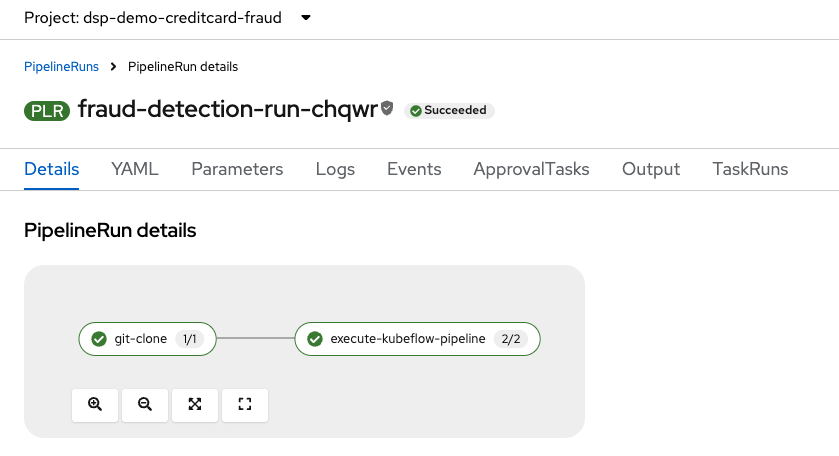

1. The Data Science Pipeline will run to train the model

    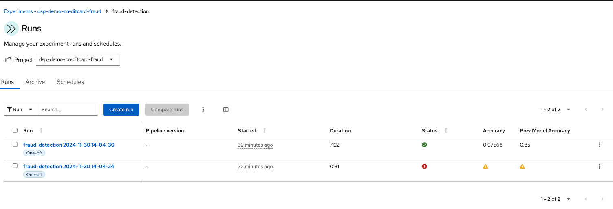

    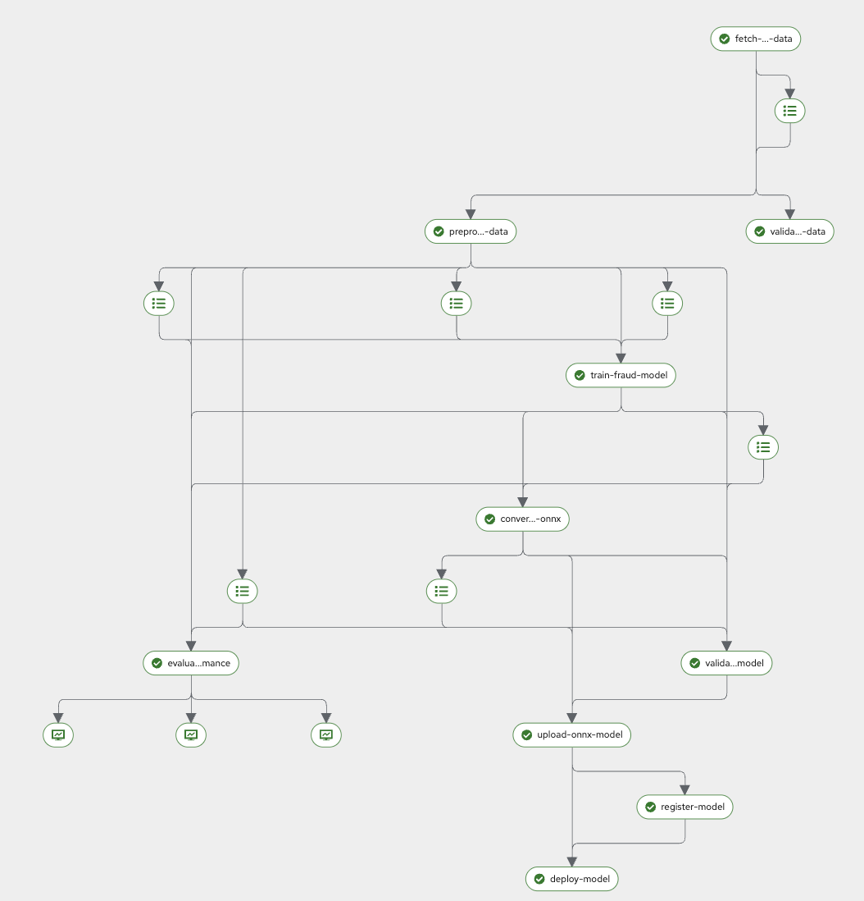

1. Model will be saved to S3 bucket

    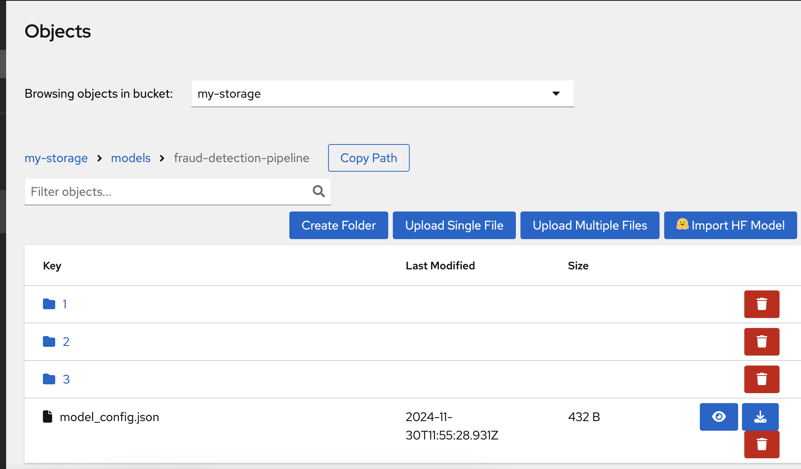

1. Model will be registered with the model registry

    The model details:
    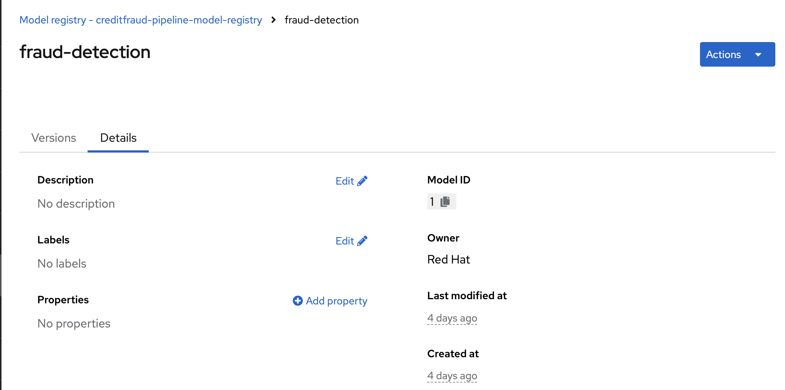

    The various versions:
    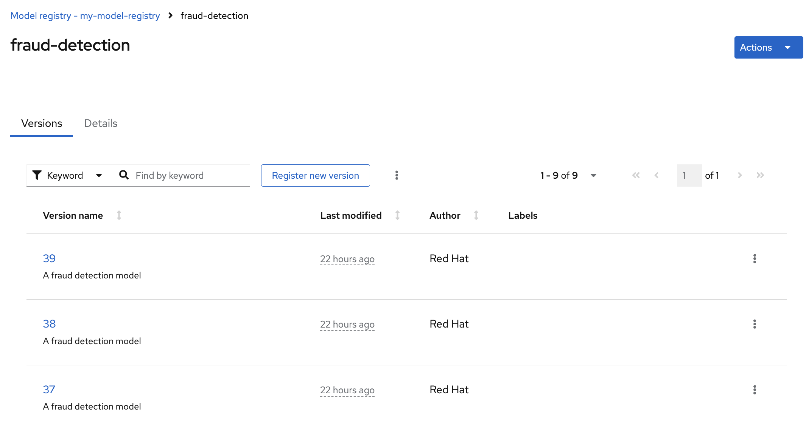

    The details of a model version. E.g. version 4:
    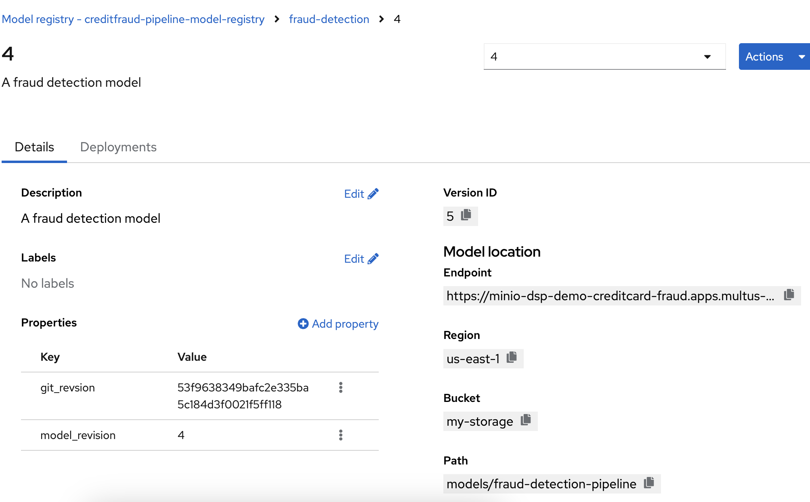


1. Model will be deployed to KServe

    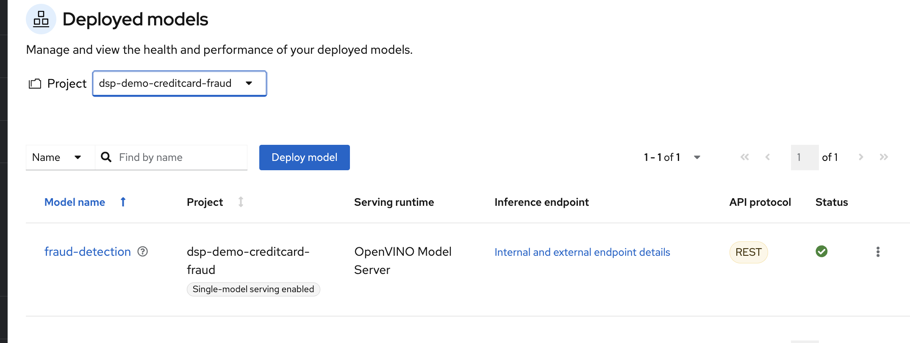

# Deploying the model using model registry

After the model is registered, you can manually deploy it.

1. Manual deployment
    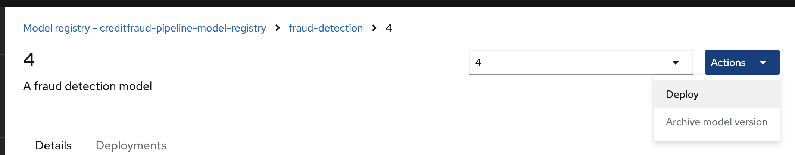

1. Model registry deployment view
    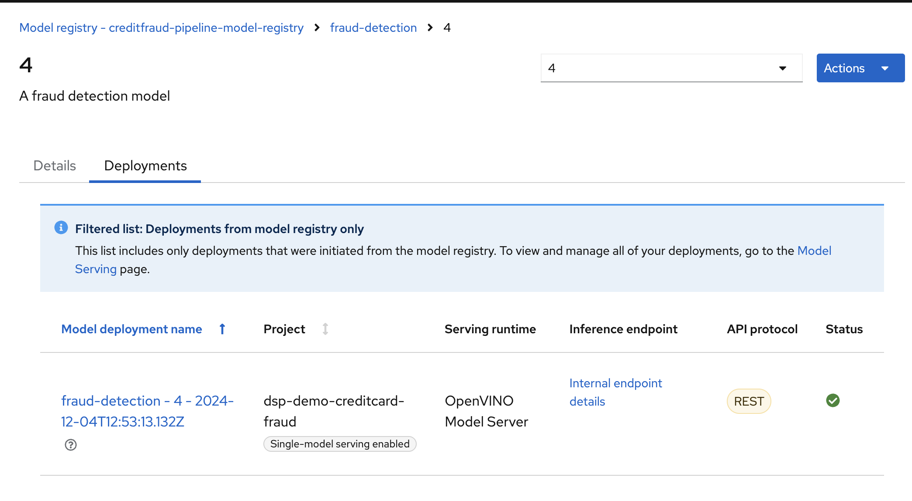

1. The `InferenceService` annotations
    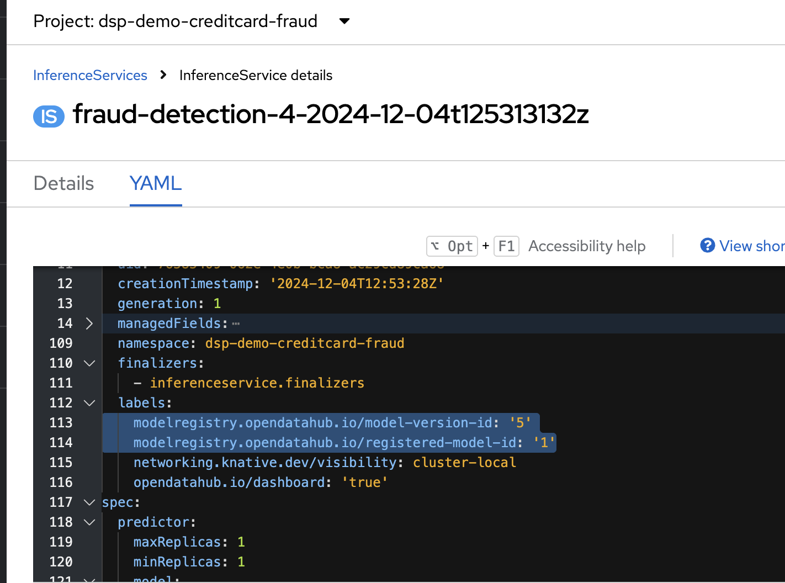


# Known Issues

## RHOAI Admin

To [add](https://ai-on-openshift.io/odh-rhoai/openshift-group-management/#adding-kubeadmin-to-rhods-admins) kube:admin to RHOAI admin group

## Always the Latest Model Version
When you use the model registry to deploy, the current latest model will always be deployed. This is due to how OVMS and KServe storage-initializer works. 

OVMS requires a specific model repository [structure](https://docs.openvino.ai/2024/openvino-workflow/model-server/ovms_docs_models_repository.html). KServe uses the model path as the S3 path prefix to download all the files into the container. 

`model_config.json` was an attempt to solve this using a custom `ServingRuntime` as part of the data science pipeline. However, when you deploy using the model registry, the `ServingRuntime` is the default template version.

## Previous Model Accuracy Metric

Is currently hardcoded for now.

# Credits

Folks who helped me start this repo and provided guidance:
* Trevor Royer @strangiato
* Humair Khan @HumairAK
* Matteo Mortari @tarilabs
* Yuan Tang @terrytangyuan

# To-Do
1
